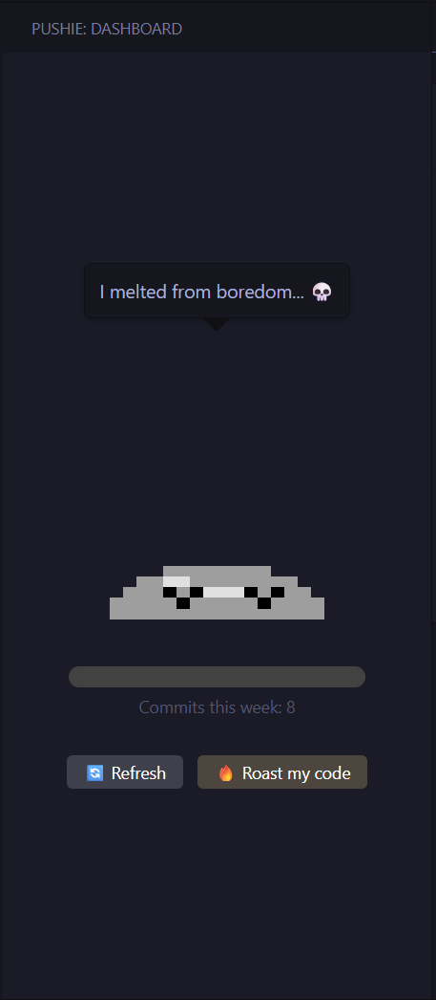
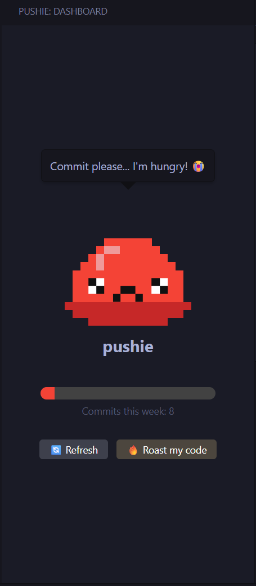
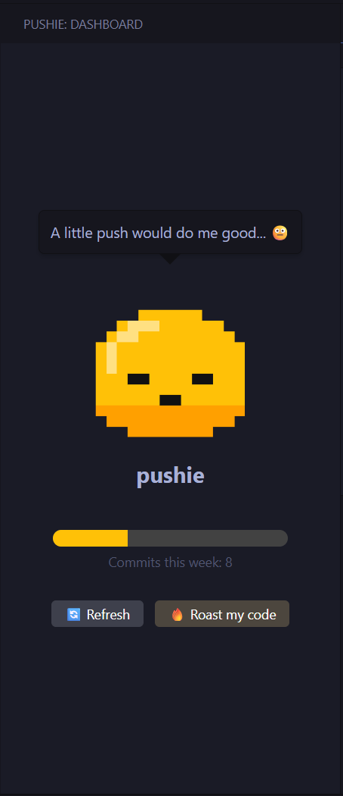
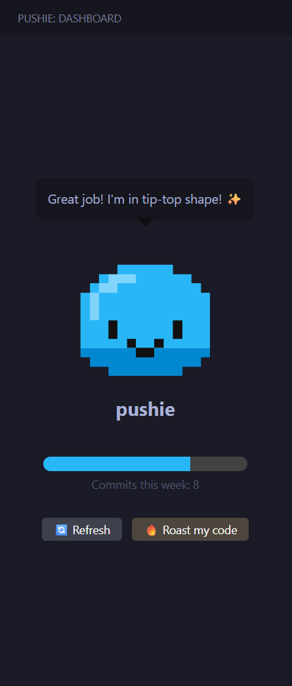
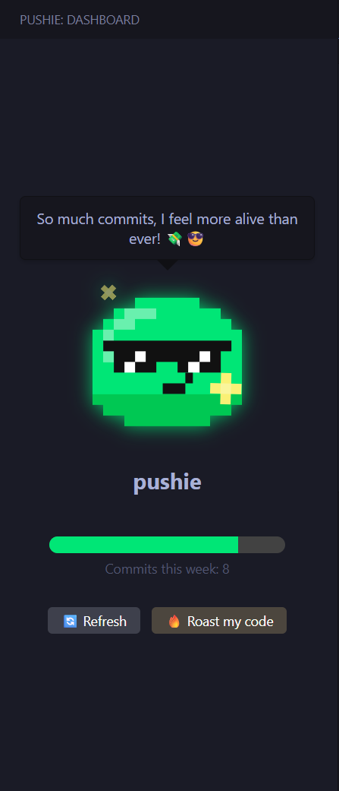

# pushie

Meet **pushie**, your cute little coding buddy who lives right inside your VS Code Editor! He loves to see you commit things and is here to cheer you on and keep you motivated on your coding journey. If you don't commit frequently in a week, pushie will start melting, get sad, and might even leave you !

pushie isn't just a pretty face... he's got a brain! Thanks to the power of AI, pushie can now roast your code with a personality as unique as your coding style... (he forced me to write this)

🌐 Access the extension page online: https://marketplace.visualstudio.com/items?itemName=maiscommentz.pushie

## 🛠️ Technologies

## ✨ Key features
- **Dynamic Pixel Art:** pushie evolves into 5 different states based on your weekly commits!
- **Interactive Personality:** Each state has its own unique animation, color, and voice line. 
- **Weekly Tracker:** Connected directly to your GitHub profile metrics to track your real commits across all branches.
- **Roast your code:** Select some code in your editor, click click on the roast button, and let pushie's AI judge your code in its signature sarcastic tone. Supports OpenAI and free Groq APIs!

## 🚀 Installation and usage

1. Open VS Code.
2. Go to the **Extensions** view (`Ctrl+Shift+X` or `Cmd+Shift+X`).
3. Search for "pushie" (once published) or install the VSIX file locally.
4. Click on the cute **Slime Icon** in your Activity Bar.
5. pushie will request access to your GitHub account to read your commit activity. **Allow** it!
6. (Optional) To enable the **Roast my code** feature, open VS Code settings, search for `pushie`, select your `AI Provider` (eg. OpenAI or Groq), select your `API Model` (eg. gpt-4o-mini), and paste your API key in the `pushie.openaiApiKey` field.
7. Start coding, pushing your commits, and watch pushie evolve throughout the week!

## 🧬 The Evolution of pushie

pushie's mood directly reflects your work ethic. He has 5 distinct states:
1. **Epic (100%+ of weekly goal):** Overflowing with confidence, wearing sunglasses, and levitating. He knows you're going to be rich together.
2. **Happy (80-99%):** A cute, squishy companion. He feels tip-top and loves to see your code.
3. **Neutral (50-79%):** He's fine, but he wouldn't mind a little push to stay motivated.
4. **Sad / Hungry (1-49%):** Drooping, with pleading eyes. He's literally starving for commits.
5. **Dead Puddle (0%):** You ignored him for too long. He melted from sheer boredom. 💀

<table width="100%" style="text-align: center;">
  <tr>
    <th width="20%">Dead Puddle</th>
    <th width="20%">Sad / Hungry</th>
    <th width="20%">Neutral</th>
    <th width="20%">Happy</th>
    <th width="20%">Epic</th>
  </tr>
  <tr>
    <td align="center"></td>
    <td align="center"></td>
    <td align="center"></td>
    <td align="center"></td>
    <td align="center"></td>
  </tr>
</table>

## 🔥 Roast my code 

pushie isn't just about tracking commits, he's also an opinionated companion. Select any block of code in your editor, click his **"Roast my code"** button, and pushie will send your code directly to the AI (like OpenAI or Groq) to deliver a personalized and brutally honest (but funny) critique! 

**Example Roast:**
*"Junior code, but cute. Nested loops, how... quaint. O(n^2), duh."*

## 🤝 Contributing

pushie loves new friends! If you want to contribute, feel free to fork the repository and submit a Pull Request.

If you found a bug, or have an idea for a new feature, please open an issue.

Don't forget to star the project if you like it!

## 📜 License

This project is licensed under the [MIT License](LICENSE).